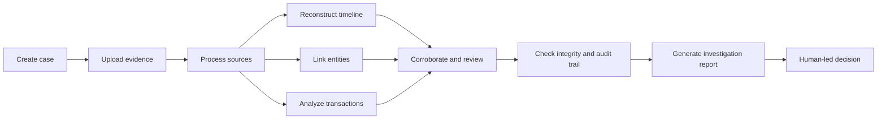

# DRISHYAM

## AI-Powered Criminal Network Analysis Platform

> **See the truth. Prove the truth.**

DRISHYAM helps authorised investigators turn fragmented digital records into an explainable network of people, places, vehicles, identifiers and events — while keeping every finding traceable to the source it came from.

The platform is built for **Smart India Hackathon 2026, Problem Statement SIH26189 — AI-Powered Criminal Network Analysis System**, proposed by the **Ministry of Home Affairs, National Crime Records Bureau (NCRB), Women Safety Division**.

SIH26189 asks for a system that processes multiple crime and intelligence sources, extracts people, locations, vehicles, phone numbers and organisations, builds relationship maps, identifies influential individuals, detects suspicious patterns, and provides visual and analytical insight for investigators.

DRISHYAM answers that as an **evidence-preserving criminal-network intelligence platform**: every relationship it draws remains traceable to the authorised source record that produced it. It is a prototype for controlled evaluation, not a deployed national crime database.

> Add an approved screenshot here before submission. Do not commit private case data or real evidence screenshots.

## Why DRISHYAM?

Digital investigations often begin with scattered files, messages, access records, transactions, and device information. Reviewing these sources manually makes it difficult to preserve context, connect related events, identify contradictions, and explain how a conclusion was reached.

DRISHYAM provides a case-centered workspace where evidence remains connected to its source and investigative findings remain reviewable by a human investigator. The system is designed to support investigation—not to replace legal judgment or declare guilt automatically.

## Core capabilities

| Capability | What it does |
|---|---|
| **Case management** | Creates and maintains an investigation case with a user-provided description and controlled access. |
| **Evidence Vault** | Uploads and organizes case-scoped evidence while preserving original files through protected storage. |
| **Evidence processing** | Processes supported evidence sources and extracts investigation-relevant events, entities, and metadata. |
| **Timeline reconstruction** | Places extracted events in chronological order using readable date and time formatting. |
| **Network** | Connects people, devices, locations, organizations, accounts and events into one relationship view, with the analysis over it on the same page. Any node opens the file it was read from. |
| **Transaction analysis** | Presents payment or transfer records with amounts, participants, status, and source context. |
| **Review** | Everything waiting on a person: the queue of unconfirmed records, claims and what supports them, and documented contradictions between sources. One destination, because they are one act — somebody deciding something. |
| **Integrity** | Whether this case's records can be verified: the audit chain recomputed on demand, the custody trail, and what processing produced each record. Technical verification does not establish truth, guilt or admissibility, and says so. |
| **Court-ready reporting** | Generates structured reports with case synopsis, evidence findings, timeline, relationships, review items, and a cautious conclusion. |
| **Trace Orb assistant** | Two scopes with a wall between them. HELP explains the interface and reaches a hosted model, so no case content may enter it. CASE answers about the open case from its own rows, with no model behind it. The scope in use is always on screen. |

### Built for SIH26189

These are the capabilities SIH26189 names, built on the existing pipeline. They are listed
separately so this README never claims more than the code does.

| Capability | Status |
|---|---|
| Person, vehicle, location and organisation extraction | **Done** — alongside phone, email, UPI, account, IFSC and reference identifiers. Each resolves to a weighted graph node with its own uncertainty caveat, and the role a source states ("Complainant", "Accused") is kept rather than discarded |
| Typed entity-to-entity relationships with provenance | **Done** — `TRANSFERRED_TO`, `REQUESTED_PAYMENT_FROM`, `CALLED`, `USED_VEHICLE`, `LOCATED_AT`, `MESSAGED`, `COMMUNICATED_WITH`, `ASSOCIATED_WITH`, `MENTIONED_WITH`. Every edge carries the evidence and source region it was read from, and direction is asserted only where the source states who acted on whom |
| Network analytics: centrality, bridge detection, communities | **Done** — betweenness/degree/eigenvector, Louvain communities, bridges, weighted shortest paths and hop-limited subgraphs. Every ranked entity carries a countable explanation and a caveat; a bare score is never returned |
| CDR and FIR source adapters | **Done** — a CDR's A-party/B-party columns give a directed `CALLED`; an FIR or surveillance note yields its header (FIR number, sections, station) and the roles its sentences state. Social-media export remains planned |
| Temporal analytics and incident-window pattern rules | **Done** — contact placed before/during/after the declared incident window, which a case can now declare at intake or later. Fourteen rules in total, including relay contact through a middle party, convergence on one location, a late-arriving identity, a vehicle corridor, and contact that stops — the last of which is often a case's strongest signal and was reported by nothing before |
| Alerts that read as a sequence, not a count | **Done** — each alert carries the sourced facts in the order the sources record them, every line naming the file and place it was read from and openable there. Stated gaps are part of the sequence; no line may contain a cause, a motive, or a relationship the source did not state |
| Source viewer: open any claim where it was read | **Done** — a graph node, a profile row, an alert line or a numbered finding opens the original PDF page, CSV cell, text line or image region, marked in place. Where a place cannot be found it says so rather than marking an approximate one |
| Entity profile and summary | **Done** — what one case records about one identity: how it was written, where it was seen, what states a relationship to it, when, and which other cases know it. Aliases are listed without being merged; two spellings stay two identities until a person decides otherwise |
| Case-grounded, permission-aware assistant | **Done** — CASE scope answers from the case's own rows with no model behind it, so questions and case content never leave the server. HELP scope explains the product and reaches a hosted model; the scope in use is stated on screen at all times and chosen by the operator, never inferred |
| Report a reader can interrogate | **Done** — read in place without downloading, search inside it with every occurrence marked rather than counted, and ask questions of it offline. Findings are numbered `F-01` upward, stored as printed so a number cited elsewhere keeps its meaning, and each opens at its source |
| Verifiable record: chain, root, receipts | **Done** — the audit chain is walked and recomputed on demand and at report generation, naming the exact entry and fault kind where it breaks. A Merkle root fixes which evidence files a report covered, and one file's membership can be proved to a court without disclosing the others' hashes |
| Cross-force identifier discovery (the blockchain obligation) | **Done** — a shared, append-only, chained ledger holding only a keyed digest of an identifier, a case reference and a contact. Two districts can discover a shared identifier without either seeing the other's case. Off by default behind three independent switches. It is not a blockchain and does not claim to be: no consensus, no mining, no distributed agreement |
| Investigator workflow: notes, export, requisitions, what changed | **Done** — notes kept apart from extracted facts and marked as commentary; CSV/JSON export carrying every row's source under the report's own redaction rule; a requisition drafted from what the case records, which the officer sends under their own name; and a per-reader digest of what arrived since they last opened the case |


## Investigation workflow



Every finding should be interpreted with its source and context. Automated extraction can identify patterns and leads, but the final interpretation remains with the authorized investigator.

## Platform architecture

| Layer | Technology / responsibility |
|---|---|
| **Frontend** | React, TypeScript, Vite, Tailwind CSS, and reusable UI components. |
| **Backend API** | FastAPI services for authentication, cases, evidence, analysis, review, notifications, and reports. |
| **Data layer** | SQLAlchemy models with Alembic migrations and PostgreSQL-compatible persistence. |
| **Processing** | Celery-based background processing for evidence workflows. |
| **Storage** | Case-scoped protected storage using Supabase Private Object Storage with a filesystem fallback for local development. |
| **Authentication** | JWT-based protected sessions, email OTP verification, Google sign-in readiness, per-user case access, and session controls. |
| **Reporting** | Server-side report generation with readable narratives, timeline tables, relationship analysis, review context, and integrity information. |

## Repository structure

```text
.
├── backend/
│   ├── app/
│   │   ├── api/          # FastAPI routes
│   │   ├── core/         # configuration and security foundations
│   │   ├── models/       # database models
│   │   ├── schemas/      # request and response contracts
│   │   ├── services/     # storage, processing, reporting and audit logic
│   │   └── workers/      # background processing workers
│   ├── migrations/       # database migrations
│   ├── tests/            # backend tests
│   ├── docker-compose.yml
│   └── .env.example      # placeholders only; never real secrets
├── frontend/
│   ├── client/
│   │   └── src/
│   │       ├── api/      # frontend API clients
│   │       ├── components/
│   │       ├── pages/
│   │       └── pages/workspace/
│   └── package.json
├── docs/
└── README.md
```

## Running DRISHYAM on your own machine

There are two ways to run this, and the difference matters.

**The self-contained stack** brings its own PostgreSQL, its own Redis and its own throwaway secrets.
It needs no accounts, no API keys and no credentials from anybody. Use this one. It is what the rest
of this section describes.

**The hosted stack** (`docker-compose.yml`) has no database of its own and expects a managed
PostgreSQL, a Redis, and real provider credentials supplied through a runtime file. It exists for
the team's shared deployment. You do not need it to run, demo or develop against DRISHYAM, and
following it without those credentials will simply fail to start.

### What you need

**Docker Desktop** (running), **Node.js 22 or newer**, **Git**. That is all — there is no Python,
PostgreSQL or Redis to install locally; the stack carries them.

| Service | Address | What it is |
|---|---|---|
| Frontend | `http://127.0.0.1:5173` | The browser interface |
| Backend API | `http://127.0.0.1:8000` | Everything the interface reads and writes |
| Health check | `http://127.0.0.1:8000/health` | Whether the backend is up |

### 1. Get the code

```bash
git clone https://github.com/Namkar255/DRISHYAM.git
cd DRISHYAM
```

### 2. Start the backend

```bash
cd backend
docker compose -f docker-compose.demo.yml up -d --build
```

The first build takes a few minutes. It starts PostgreSQL, Redis, the API and the background
worker, and applies every database migration on the way up.

Check it is ready:

```bash
curl http://127.0.0.1:8000/health
docker compose -f docker-compose.demo.yml ps
```

> **Port 8000 already in use?** Something else on your machine is holding it — commonly another
> DRISHYAM stack from an earlier attempt. `docker ps` will show it. Stop that one first; two API
> containers cannot share the port, and whichever starts second dies.

### 3. Start the frontend

In a second terminal:

```bash
cd frontend
corepack enable
corepack pnpm install --frozen-lockfile
corepack pnpm dev
```

Open `http://127.0.0.1:5173`. The interface looks for the API at `http://127.0.0.1:8000/api/v1`
unless you set `VITE_API_BASE_URL`.

### 4. Sign in — read the OTP from the local mailbox

The self-contained stack does not send email. Sign-up codes are written to a file inside the
container instead, which is deliberate: a local prototype that could send real mail to a real
address is a mistake waiting to happen.

Sign up in the browser, then read the code:

```bash
docker compose -f docker-compose.demo.yml exec api \
  sh -c 'cat $(ls -t /app/data/dev_mailbox/verification-*.json | head -1)'
```

The JSON holds the six-digit code. Paste it into the browser and you are in.

### 5. Put something in a case

Create a case, then upload evidence to it. The repository ships a synthetic benchmark case — a
first information report, a call detail record, a bank statement and a chat export, all fabricated —
which is what the tests run against and what the demo uses:

```bash
# Generate the files inside the container, then copy them out to your machine
docker compose -f docker-compose.demo.yml exec api python -m scripts.benchmark_case
docker compose -f docker-compose.demo.yml cp api:/app/generated_evidence/benchmark ./benchmark-evidence
```

Nine files land in `backend/benchmark-evidence/`. Upload them through the Evidence Vault, choosing
the matching source type for each — a call detail record read as a chat export will be parsed
wrongly and the network will be wrong with it.

Everything else — the network, the timeline, the alerts, the report — is read out of whatever you
upload. Nothing is seeded.

### Stopping and resetting

```bash
# Stop, keeping the data
docker compose -f docker-compose.demo.yml down

# Stop and delete the local database, uploaded evidence and generated reports
docker compose -f docker-compose.demo.yml down -v
```

The `-v` throws away everything the stack has stored. That is fine for a local prototype and
unrecoverable, so read the command before running it.

### Optional: the shared identifier ledger

Off by default. It lets two forces discover that they hold the same identifier without either
seeing the other's case, and is the one place in this product where a shared, chained record earns
its cost. To switch it on, create `backend/.env` and add:

```bash
LEDGER_ENABLED=true
LEDGER_PUBLICATION=enabled
LEDGER_KEY=<generate one, see below>
```

```bash
python -c "import secrets; print(secrets.token_urlsafe(48))"
```

The key is not optional and not decoration. There are only about ten billion phone numbers, so an
unkeyed digest of one can be enumerated in an afternoon — publishing it would be publishing the
number. Every participating district must hold the same key or their digests will not match.

`backend/.env` is git-ignored. Real values belong there and never in `backend/.env.example`, which
is a committed template.

### Running the tests

The suite runs against a separate database so it can wipe tables between tests without touching
anything you have been working on:

```bash
cd backend
docker compose -f docker-compose.demo.yml exec db \
  psql -U drishyam -d drishyam -c "CREATE DATABASE drishyam_test;"

docker compose -f docker-compose.demo.yml exec \
  -e DATABASE_URL="postgresql+psycopg://drishyam:drishyam@db:5432/drishyam_test" \
  api python -m pytest tests -q
```

It takes fifteen to twenty minutes, because it generates real PDFs and runs the real extraction
pipeline rather than mocking them. Run only one at a time — two concurrent runs share the database
and deadlock.

Frontend checks:

```bash
cd frontend
corepack pnpm check     # TypeScript
corepack pnpm build     # production build
```

### When you change backend code

The API image copies the source in rather than mounting it, so a code change does not reach a
running container. Rebuild both — the API and the worker are separate images, and updating one
leaves the other on old code:

```bash
cd backend
docker compose -f docker-compose.demo.yml up -d --build api worker
```


## Authentication and authorization

DRISHYAM protects workspace and evidence operations behind authentication. Email OTP verification is required before an account receives an authenticated session. Google sign-in is validated on the backend when configured. User identity, verification state, role, and case access are enforced server-side rather than being trusted from frontend-only values.

The system is designed around the following safeguards:

- Unverified accounts must not access protected workspace APIs.
- Investigator access is the safe default; role escalation must not be controlled by an untrusted client.
- Cases and evidence are scoped to the authenticated user and authorized workspace.
- Sessions can be reviewed and older sessions can be revoked according to the configured auth policy.
- Credentials, OTPs, refresh tokens, private keys, and provider secrets remain outside Git.

## Evidence and report safety

This project is intended for controlled evaluation and authorized investigations. Do not upload real evidence, personally identifiable information, confidential records, or production credentials into an unapproved environment.

The platform should use terms such as **linked evidence**, **candidate inconsistency**, **requires corroboration**, and **requires human review**. A detected pattern is not automatically a legal conclusion. Reports should distinguish between an extracted fact, a source statement, an automated lead, and an investigator-verified finding.

## Demonstration flow

The sidebar holds eleven destinations. A demonstration that shows the product's argument rather than
its feature list can follow this sequence:

1. Sign in with a verified account, and let the case say **what changed since you were last here**.
2. Create or select a case, and declare its **incident window** — or show that leaving it undeclared
   is a real answer the system accepts rather than a field it nags about.
3. Upload the synthetic benchmark evidence. Watch **Evidence Vault** report what was read, what is
   still being read, and what failed.
4. **Timeline** — records placed against the declared incident, with those whose time was never
   established held back rather than guessed at.
5. **Network** — the relationship map and the analysis over it. Click a name: a five-sentence
   summary, then the full profile. Click any row and the original file opens at that page, row or
   image region.
6. **Alerts** — open the page on its instruction, not a count. Expand a pattern to read the sourced
   sequence behind it, and click a line to land in the evidence.
7. **Review** — the queue, claims and contradictions, all in one place because they are one act.
8. **Integrity** — recompute the audit chain live. If time allows, edit one audit row in the
   database first and let the check name the exact entry and fault.
9. **Reports** — read the report in place without downloading it, search inside it with every
   occurrence marked, ask it a question offline, and open `F-01` at the row it was read from.
10. The **shared ledger**, if switched on: two accounts, two cases, one number — discovered without
    either officer seeing the other's file.

For SIH evaluation, use only clearly labelled synthetic records. Keep the graph compact enough that
the relationships remain readable and explainable.

## Team contributions

The project is divided into four contribution areas. Each member works on their own named branch
and opens a Pull Request into `main`.

| Member | Contribution area | Branch |
|---|---|---|
| **Member 1** | Complete Home frontend: landing page, hero, public sections, animations, Trace Orb interface, and responsive Home presentation | `Garg` |
| **Member 2** | Workspace frontend: workspace shell, evidence views, timeline, network, transactions, alerts, review, reports, profile and settings UI, and frontend API integration | `Pandey` |
| **Member 3** | Login/signup backend: email OTP, Google sign-in, sessions, verification, identity mapping, session revocation, auth protection, auth schemas and auth migrations | `Tanishk` |
| **Member 4** | Core backend: cases, evidence, processing, storage, timeline, graph, transactions, alerts, review and report APIs, Celery workers, report generation, and non-auth migrations and tests | `Namkar` |

Shared files — routing, common CSS, package manifests, Docker files, this README — must be
coordinated before editing.


## GitHub contribution workflow

The repository carries one branch per team member — `Namkar`, `Tanishk`, `Pandey`, `Garg` — plus
`main`. Work on your own branch and open a Pull Request into `main` from there. New feature branches
are not created per piece of work; they proliferate and then have to be reasoned about and deleted.

```bash
# Start from your own branch, brought up to date with main
git fetch origin
git checkout <your-branch>
git merge --ff-only origin/main

# Commit what you own
git status
git add <your-paths>
git commit -m "Describe what changed and why"

# Push and open a Pull Request into main
git push origin <your-branch>
```

Before opening the PR, run what the change touches: the backend suite for backend work, and
`corepack pnpm check` plus `corepack pnpm build` for frontend work. A Pull Request should say what
changed, how it was tested, and anything a reviewer would otherwise have to work out for
themselves.

**Never commit a real secret.** `backend/.env` is git-ignored and is where real values belong.
`backend/.env.example` is a committed template and must hold placeholders only — a key pasted into
it goes public the moment the branch is pushed.


## Current scope and limitations

DRISHYAM is a hackathon-oriented investigation prototype. Automated extraction can produce incomplete or uncertain results, and synthetic evaluation data does not establish real-world truth. Production use would require additional security review, legal and procedural validation, stronger operational monitoring, formal retention policies, access governance, performance testing, and deployment-specific threat modelling.

The platform must not be used to make an automated accusation, deny a person’s rights, or replace an authorized investigator, legal process, or court.

## SIH26189 positioning

Recommended project wording:

> **DRISHYAM — an AI-assisted criminal-network discovery platform for SIH26189.** It preserves original digital evidence, extracts entities and events from heterogeneous sources, resolves cross-source identities, maps evidence-supported relationships, analyses temporal and network patterns, and provides explainable, source-cited intelligence for authorised investigators.

**DRISHYAM does not declare guilt.** It helps investigators discover, verify and understand relationships that are difficult to see manually.

### How each SIH26189 obligation is answered

| PS obligation | DRISHYAM capability | Proof shown in the demo |
|---|---|---|
| Process multiple sources | Adapters for FIR/police reports, screenshots, CDR, financial transactions and surveillance notes, sharing one internal record contract | At least four source types processed in one case |
| Extract entities | Person, location, vehicle, phone and organisation extraction with source region, confidence and review state | Entity list with source location and stated uncertainty |
| Build relationship maps | Typed, event-aware relationships that always carry provenance | A graph edge opened to its supporting evidence |
| Identify influential individuals | Degree and betweenness centrality, bridge detection, community and cross-case analysis | An explanation of *why* a node is important |
| Detect suspicious patterns | Transparent, versioned temporal and graph rules | One alert with its supporting sources and review state |
| Provide visual insight | Network view, timeline, filters, paths, entity profiles and drill-down | Investigator workspace walkthrough |
| Provide actionable intelligence | Permission-aware, source-cited answers and ranked review leads | An answer carrying source references and uncertainty |

### Claims this project does not make

Stating limits plainly is part of the submission, not a weakness in it:

- No claim of guilt, criminality or crime prediction. The system produces investigation leads.
- No live access to NCRB, CDR, banking, surveillance or intelligence databases. The prototype uses synthetic records; real connectors require lawful authorisation.
- No claim of 100% OCR accuracy, unlimited data volume, real-time national analysis, or production deployment.
- No single "AI accuracy" figure. Accuracy is reported per component against a labelled benchmark.
- Network centrality is reported as **network importance** or **review priority** — never as an indication of guilt.
- The shared identifier ledger is **not a blockchain** and is not described as one. It is an append-only, hash-chained store with a key shared between participating forces. There is no consensus, no mining and no distributed agreement, and claiming otherwise would be a claim about Byzantine fault tolerance that nothing here provides.
- Nothing from a case reaches a hosted model. Case-scoped answers are assembled from the case's own rows by template, which is also what makes every sentence citable.
- An absence of records is never reported as evidence of absence. "No contact is recorded between them" is a statement about the record, not about what happened.

### Headline metric

**Traceability Coverage** = graph claims with valid source evidence ÷ total graph claims.

This is more meaningful for DRISHYAM than a generic accuracy number, and the pipeline is built to keep it at 100%: a relationship without a source reference is never written to the graph.

## License

Add the team’s approved license here before making the repository public. If no license has been selected, write `License: To be decided by the project team` rather than implying permissions that have not been granted.

## References

[1]: https://fastapi.tiangolo.com/ "FastAPI Documentation"

[2]: https://react.dev/ "React Documentation"

[3]: https://docs.docker.com/ "Docker Documentation"

[4]: https://docs.github.com/en/pull-requests/collaborating-with-pull-requests "GitHub Pull Request Documentation"

[5]: https://docs.github.com/en/repositories/configuring-branches-and-merges-in-your-repository/managing-rulesets/about-rulesets "GitHub Rulesets Documentation"
