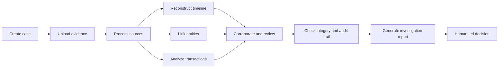

# DRISHYAM

## AI-Powered Criminal Network Analysis Platform

> **See the truth. Prove the truth.**

DRISHYAM helps authorised investigators turn fragmented digital records into an explainable network of people, places, vehicles, identifiers and events — while keeping every finding traceable to the source it came from.

The platform is built for **Smart India Hackathon 2026, Problem Statement SIH26189 — AI-Powered Criminal Network Analysis System**, proposed by the **Ministry of Home Affairs, National Crime Records Bureau (NCRB), Women Safety Division**.

SIH26189 asks for a system that processes multiple crime and intelligence sources, extracts people, locations, vehicles, phone numbers and organisations, builds relationship maps, identifies influential individuals, detects suspicious patterns, and provides visual and analytical insight for investigators.

DRISHYAM answers that as an **evidence-preserving criminal-network intelligence platform**: every relationship it draws remains traceable to the authorised source record that produced it. It is a prototype for controlled evaluation, not a deployed national crime database.

> Add an approved screenshot here before submission. Do not commit private case data or real evidence screenshots.

## Why DRISHYAM?

Digital investigations often begin with scattered files, messages, access records, transactions, and device information. Reviewing these sources manually makes it difficult to preserve context, connect related events, identify contradictions, and explain how a conclusion was reached.

DRISHYAM provides a case-centered workspace where evidence remains connected to its source and investigative findings remain reviewable by a human investigator. The system is designed to support investigation—not to replace legal judgment or declare guilt automatically.

## Core capabilities

| Capability | What it does |
|---|---|
| **Case management** | Creates and maintains an investigation case with a user-provided description and controlled access. |
| **Evidence Vault** | Uploads and organizes case-scoped evidence while preserving original files through protected storage. |
| **Evidence processing** | Processes supported evidence sources and extracts investigation-relevant events, entities, and metadata. |
| **Timeline reconstruction** | Places extracted events in chronological order using readable date and time formatting. |
| **Entities & Graph** | Connects people, devices, locations, organizations, accounts, and events into a focused relationship view. |
| **Transaction analysis** | Presents payment or transfer records with amounts, participants, status, and source context. |
| **Corroboration** | Compares independent evidence sources to identify facts supported by more than one source. |
| **Contradiction review** | Highlights inconsistencies between statements or records for human verification. |
| **Review Queue** | Keeps unresolved evidence, alerts, and findings visible until an investigator reviews them. |
| **Integrity** | Preserves source and verification context so investigators can assess whether records remain reliable. |
| **Custody / Audit** | Records important evidence and investigation actions to support a traceable chain of custody. |
| **Court-ready reporting** | Generates structured reports with case synopsis, evidence findings, timeline, relationships, review items, and a cautious conclusion. |
| **Trace Orb assistant** | Provides simple explanations of DRISHYAM’s interface and investigation concepts for users. Deliberately isolated from case data. |

### Built for SIH26189 — in progress

These capabilities are required by SIH26189 and are being added on the existing pipeline. They are listed separately so this README never claims more than the code does. See `DRISHYAM_SIH26189_Change_Roadmap.pdf` for the file-level plan.

| Capability | Status |
|---|---|
| Person, vehicle, location and organisation extraction | In progress — phone, email, UPI, account, IFSC and reference identifiers already extracted |
| Typed entity-to-entity relationships with provenance (`CALLED`, `TRANSFERRED_TO`, `LOCATED_AT`, `USED_VEHICLE`) | In progress — evidence-to-identifier linking already works |
| Network analytics: centrality, bridge detection, communities | Planned |
| CDR and FIR source adapters | Planned — generic CSV, PDF, image and email parsing already works |
| Temporal analytics and incident-window pattern rules | Planned — five explainable alert rules already run |
| Entity Profile and Relationship Detail drill-down screens | Planned |
| Case-grounded, permission-aware assistant | Planned — separate from the Trace Orb help assistant |

## Investigation workflow



Every finding should be interpreted with its source and context. Automated extraction can identify patterns and leads, but the final interpretation remains with the authorized investigator.

## Platform architecture

| Layer | Technology / responsibility |
|---|---|
| **Frontend** | React, TypeScript, Vite, Tailwind CSS, and reusable UI components. |
| **Backend API** | FastAPI services for authentication, cases, evidence, analysis, review, notifications, and reports. |
| **Data layer** | SQLAlchemy models with Alembic migrations and PostgreSQL-compatible persistence. |
| **Processing** | Celery-based background processing for evidence workflows. |
| **Storage** | Case-scoped protected storage using Supabase Private Object Storage with a filesystem fallback for local development. |
| **Authentication** | JWT-based protected sessions, email OTP verification, Google sign-in readiness, per-user case access, and session controls. |
| **Reporting** | Server-side report generation with readable narratives, timeline tables, relationship analysis, review context, and integrity information. |

## Repository structure

```text
.
├── backend/
│   ├── app/
│   │   ├── api/          # FastAPI routes
│   │   ├── core/         # configuration and security foundations
│   │   ├── models/       # database models
│   │   ├── schemas/      # request and response contracts
│   │   ├── services/     # storage, processing, reporting and audit logic
│   │   └── workers/      # background processing workers
│   ├── migrations/       # database migrations
│   ├── tests/            # backend tests
│   ├── docker-compose.yml
│   └── .env.example      # placeholders only; never real secrets
├── frontend/
│   ├── client/
│   │   └── src/
│   │       ├── api/      # frontend API clients
│   │       ├── components/
│   │       ├── pages/
│   │       └── pages/workspace/
│   └── package.json
├── docs/
└── README.md
```

## Local requirements

The verified local prototype requires **Docker Desktop**, **Node.js 22 or newer**, **Git**, and **VS Code**. Docker Desktop must be running before starting the backend.

| Service | Local address | Purpose |
|---|---|---|
| Frontend | `http://127.0.0.1:5173` | DRISHYAM browser interface |
| Backend API | `http://127.0.0.1:8000` | Authentication, cases, evidence, analysis, and reports |
| Health check | `http://127.0.0.1:8000/health` | Backend availability check |

## Safe local setup

Clone the repository and open its root in VS Code. Keep the backend runtime configuration outside the repository. The runtime file may contain provider credentials, database URLs, email configuration, OAuth values, or service keys, so it must never be committed.

```powershell
# Clone the repository
git clone https://github.com/<github-username>/<repository-name>.git
cd <repository-name>
```

The backend runtime file should be stored outside the project, for example:

```text
C:\Users\<your-user>\.drishyam\drishyam-staging.env
```

Create it from `backend/.env.example` and fill values directly from the owner-controlled provider dashboards. Never paste secrets into source files, issues, screenshots, Pull Requests, or chat.

### Start the backend

Open a PowerShell terminal in the repository root:

```powershell
cd backend
$env:DRISHYAM_RUNTIME_ENV_FILE = "C:\Users\<your-user>\.drishyam\drishyam-staging.env"
docker compose up -d --build
docker compose ps
```

Check the backend at `http://127.0.0.1:8000/health`.

### Start the frontend

Open a second PowerShell terminal:

```powershell
cd frontend
corepack enable
corepack pnpm install --frozen-lockfile
corepack pnpm dev
```

Open the Vite URL, normally `http://127.0.0.1:5173`.

### Optional checks

```powershell
# Frontend type check
cd frontend
corepack pnpm check

# Backend isolated tests; do not send a real email
cd ..\backend
docker compose exec api pytest -q tests/test_auth_identity.py tests/test_gmail_api_email.py tests/test_google_identity_fallback.py tests/test_end_to_end.py
```

### Stop the local prototype

```powershell
# Stop the frontend with Ctrl+C in its terminal.
cd backend
docker compose down
```

Do not use destructive database or Docker volume commands unless the project owner explicitly intends to reset local data.

## Authentication and authorization

DRISHYAM protects workspace and evidence operations behind authentication. Email OTP verification is required before an account receives an authenticated session. Google sign-in is validated on the backend when configured. User identity, verification state, role, and case access are enforced server-side rather than being trusted from frontend-only values.

The system is designed around the following safeguards:

- Unverified accounts must not access protected workspace APIs.
- Investigator access is the safe default; role escalation must not be controlled by an untrusted client.
- Cases and evidence are scoped to the authenticated user and authorized workspace.
- Sessions can be reviewed and older sessions can be revoked according to the configured auth policy.
- Credentials, OTPs, refresh tokens, private keys, and provider secrets remain outside Git.

## Evidence and report safety

This project is intended for controlled evaluation and authorized investigations. Do not upload real evidence, personally identifiable information, confidential records, or production credentials into an unapproved environment.

The platform should use terms such as **linked evidence**, **candidate inconsistency**, **requires corroboration**, and **requires human review**. A detected pattern is not automatically a legal conclusion. Reports should distinguish between an extracted fact, a source statement, an automated lead, and an investigator-verified finding.

## Demonstration flow

A clear demonstration can follow this sequence:

1. Sign in with a verified account.
2. Create or select a case and provide a meaningful case description.
3. Upload a small, synthetic evidence set.
4. Open Evidence Vault to show processing status and source context.
5. Review Timeline for chronological reconstruction.
6. Open Entities & Graph to show focused relationships.
7. Inspect Transactions and Alerts for linked activity.
8. Use Corroboration and Contradictions to explain why human review matters.
9. Open Review Queue and Custody / Audit to show traceability.
10. Generate and download the structured report.

For SIH evaluation, use only clearly labelled synthetic records. Keep the graph compact enough that the relationships remain readable and explainable.

## Team contributions

The project is divided into exactly four contribution areas. Each member should work on a named branch, create meaningful commits, push the branch, and open a Pull Request against `develop`. Direct pushes to `main` should be avoided.

| Member | Contribution area | Suggested branch |
|---|---|---|
| **Member 1** | Complete Home frontend: landing page, hero, public sections, animations, Trace Orb/pet interface, and responsive Home presentation | `feature/member1-home-frontend` |
| **Member 2** | Open Workspace and remaining frontend: workspace shell, evidence views, timeline, graph, transactions, alerts, review, reports, profile/settings UI, and frontend API integration | `feature/member2-workspace-frontend` |
| **Member 3** | Complete Login/Signup backend: email OTP, Google sign-in, sessions, verification, identity mapping, session revocation, auth protection, auth schemas, and auth-related migrations/tests | `feature/member3-auth-backend` |
| **Member 4** | Remaining backend: cases, evidence, processing, storage, timeline, graph, transactions, alerts, review/report APIs, Celery workers, database services, report generation, and non-auth migrations/tests | `feature/member4-core-backend` |

Shared files such as routing, common CSS, package manifests, Docker files, and README changes must be coordinated before editing. The contribution history must remain truthful: do not pretend that an earlier single bulk commit was created by four people. Build the contribution trail through new branches, commits, Pull Requests, reviews, and merged features.

## GitHub contribution workflow

```bash
# Maintainer creates a feature branch from develop
git fetch origin
git checkout develop
git pull origin develop
git checkout -b feature/<member>-<area>

# Contributor inspects and commits only assigned files
git status
git diff -- <owned-path>
git add <owned-path>
git commit -m "feat(<area>): describe the contribution"

# Push branch and open a Pull Request
git push -u origin feature/<member>-<area>
```

Every Pull Request should describe what changed, list owned files, explain how it was tested, and identify any shared-file coordination. The maintainer reviews the changed-file boundary, runs the relevant checks, resolves feedback, and merges the PR into `develop`. Once the integrated system is tested, the maintainer opens the release PR from `develop` to `main`.

## Current scope and limitations

DRISHYAM is a hackathon-oriented investigation prototype. Automated extraction can produce incomplete or uncertain results, and synthetic evaluation data does not establish real-world truth. Production use would require additional security review, legal and procedural validation, stronger operational monitoring, formal retention policies, access governance, performance testing, and deployment-specific threat modelling.

The platform must not be used to make an automated accusation, deny a person’s rights, or replace an authorized investigator, legal process, or court.

## SIH26189 positioning

Recommended project wording:

> **DRISHYAM — an AI-assisted criminal-network discovery platform for SIH26189.** It preserves original digital evidence, extracts entities and events from heterogeneous sources, resolves cross-source identities, maps evidence-supported relationships, analyses temporal and network patterns, and provides explainable, source-cited intelligence for authorised investigators.

**DRISHYAM does not declare guilt.** It helps investigators discover, verify and understand relationships that are difficult to see manually.

### How each SIH26189 obligation is answered

| PS obligation | DRISHYAM capability | Proof shown in the demo |
|---|---|---|
| Process multiple sources | Adapters for FIR/police reports, screenshots, CDR, financial transactions and surveillance notes, sharing one internal record contract | At least four source types processed in one case |
| Extract entities | Person, location, vehicle, phone and organisation extraction with source region, confidence and review state | Entity list with source location and stated uncertainty |
| Build relationship maps | Typed, event-aware relationships that always carry provenance | A graph edge opened to its supporting evidence |
| Identify influential individuals | Degree and betweenness centrality, bridge detection, community and cross-case analysis | An explanation of *why* a node is important |
| Detect suspicious patterns | Transparent, versioned temporal and graph rules | One alert with its supporting sources and review state |
| Provide visual insight | Network view, timeline, filters, paths, entity profiles and drill-down | Investigator workspace walkthrough |
| Provide actionable intelligence | Permission-aware, source-cited answers and ranked review leads | An answer carrying source references and uncertainty |

### Claims this project does not make

Stating limits plainly is part of the submission, not a weakness in it:

- No claim of guilt, criminality or crime prediction. The system produces investigation leads.
- No live access to NCRB, CDR, banking, surveillance or intelligence databases. The prototype uses synthetic records; real connectors require lawful authorisation.
- No claim of 100% OCR accuracy, unlimited data volume, real-time national analysis, or production deployment.
- No single "AI accuracy" figure. Accuracy is reported per component against a labelled benchmark.
- Network centrality is reported as **network importance** or **review priority** — never as an indication of guilt.

### Headline metric

**Traceability Coverage** = graph claims with valid source evidence ÷ total graph claims.

This is more meaningful for DRISHYAM than a generic accuracy number, and the pipeline is built to keep it at 100%: a relationship without a source reference is never written to the graph.

## License

Add the team’s approved license here before making the repository public. If no license has been selected, write `License: To be decided by the project team` rather than implying permissions that have not been granted.

## References

[1]: https://fastapi.tiangolo.com/ "FastAPI Documentation"

[2]: https://react.dev/ "React Documentation"

[3]: https://docs.docker.com/ "Docker Documentation"

[4]: https://docs.github.com/en/pull-requests/collaborating-with-pull-requests "GitHub Pull Request Documentation"

[5]: https://docs.github.com/en/repositories/configuring-branches-and-merges-in-your-repository/managing-rulesets/about-rulesets "GitHub Rulesets Documentation"
